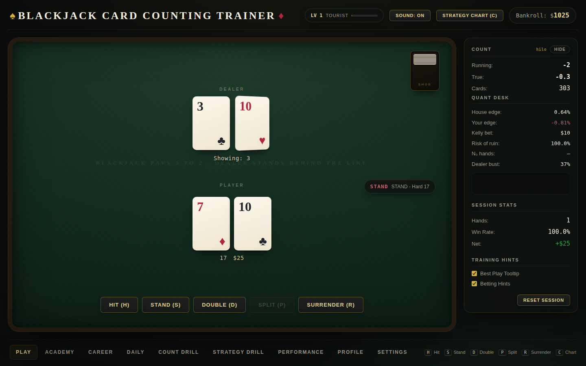
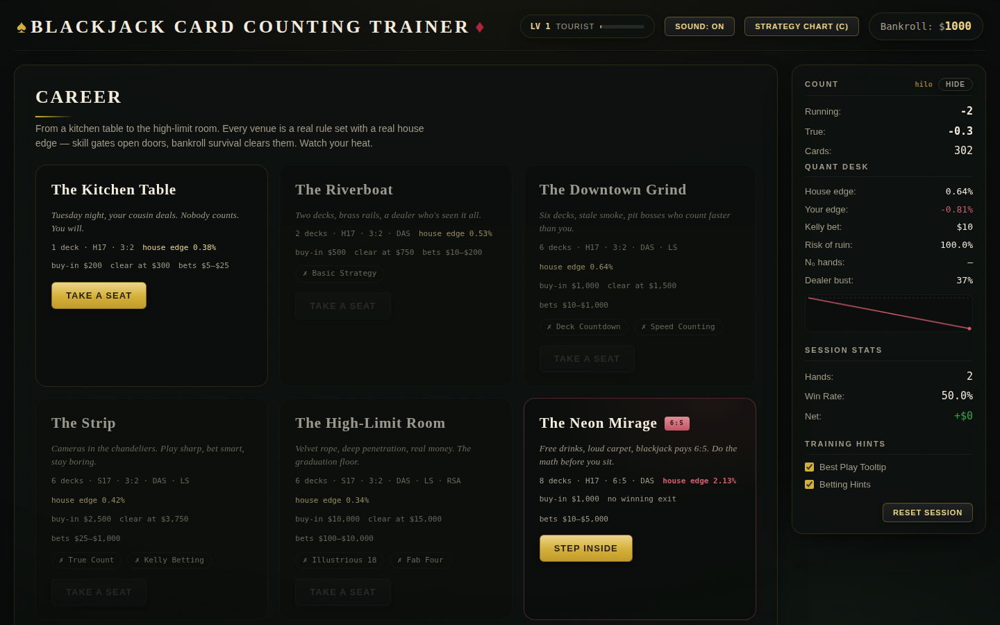
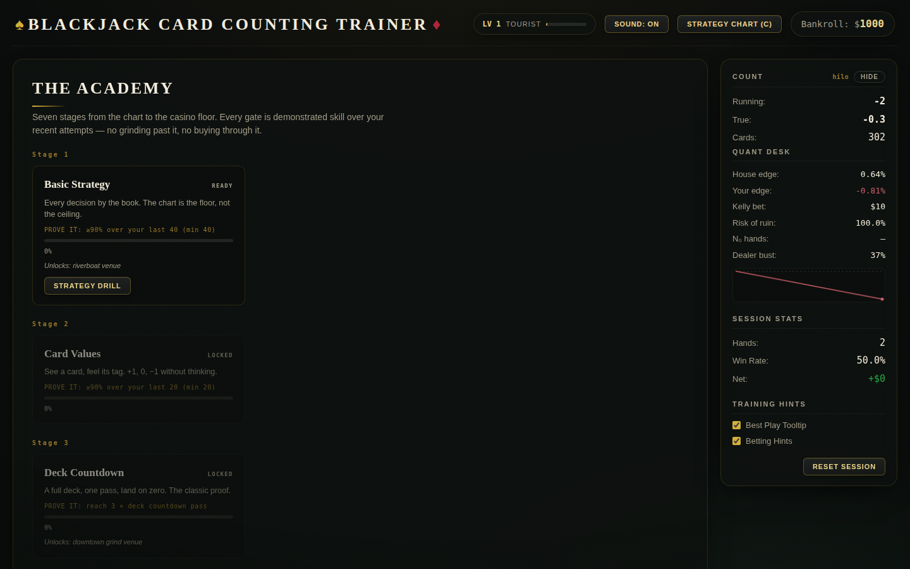
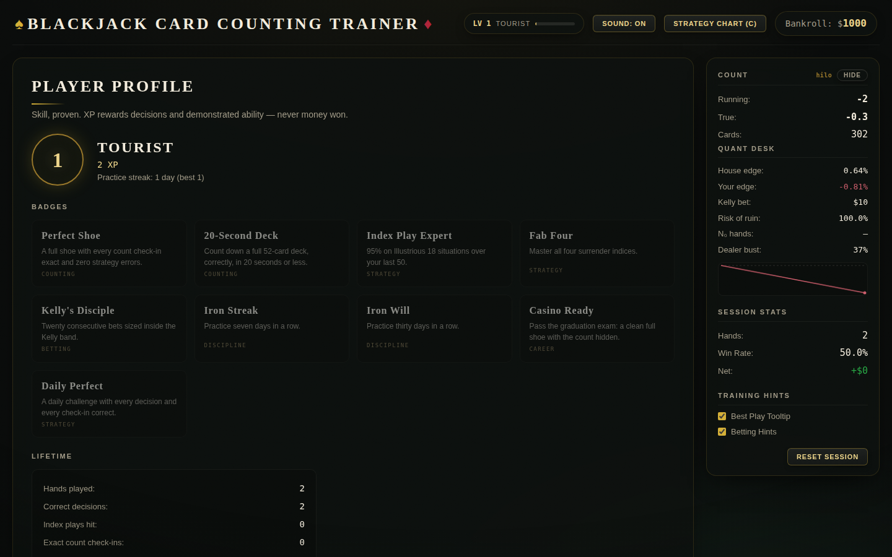

# ♠ Blackjack Noir — Card Counting Trainer ♦

A professional blackjack card counting trainer: **statistical engine first, game second**.
Every number on screen — house edges, Kelly stakes, risk of ruin, dealer bust
probabilities — is computed live by the engine, not decoration.



## What makes it different

**The math is real.** The quant desk beside the table shows the house edge of the
exact rule set you're playing, your edge at the current true count, the
half-Kelly stake for that edge, your risk of ruin, and the dealer's bust
probability for the upcard — all from `core/statistics`.

**The count is server-authoritative.** The server counts exactly what a player
at the table could see — including the dealer's hole card at reveal time and on
resolution paths that never fire a reveal event (dealer blackjack, busting out,
surrendering). Client-side counting missed those; the trainer doesn't.

**XP rewards decisions, never money.** You can lose the hand and still play it
perfectly — that's the core lesson of the game, and the progression system is
built around it. Badges are skill certificates ("Perfect Shoe", "20-Second
Deck", "Kelly's Disciple"), never participation trophies, and every gate in the
game is a demonstrated-accuracy gate, never an XP wall.

**Getting backed off teaches you something.** Career venues watch your betting.
Jump your bet the moment the count spikes and the heat meter rises — with a
plain-English reason each time. At full heat the pit taps your shoulder and the
lesson is cover betting, not superstition.

## The game

| Mode | What it is |
| --- | --- |
| **Play** | Free play on configurable rules with the full quant HUD, graded decisions (Illustrious 18 / Fab 4 aware), and Balatro-style table feel: springy 3D cards dealt from the shoe, hole-card flips, confetti blackjacks, procedural WebAudio sound — no asset files anywhere. |
| **Academy** | The skill tree: seven stages from basic strategy to casino-ready, each gated by accuracy over your recent attempts (e.g. ≥90% over your last 40). Nodes route to the drill that trains them. |
| **Career** | Five venues from The Kitchen Table (single deck, $5 bets) to The High-Limit Room ($10k max, 85% penetration) — each a real rule set priced by the engine. Skill gates open doors; bankroll survival clears them. Plus **The Neon Mirage**, a 6:5 trap room whose only winning move is checking the edge and walking away (there's a badge for that). |
| **Daily** | One seeded shoe per day — identical cards for every player. Twenty rounds, count hidden, three count check-ins. Scored 60% decisions / 30% count accuracy / 10% money, graded S–F, with an emoji grid and a rendered result card to share. |
| **Drills** | Card counting (4 systems), speed counting with server-scored runs, basic strategy, Illustrious 18 / Fab 4 deviations, and true-count conversion. |





## Quick start

```bash
python -m venv venv
source venv/bin/activate
pip install -r requirements.txt

uvicorn api.main:app --reload
# open http://localhost:8000
```

Sessions use Redis when available and fall back to in-memory storage for local
development. Player profiles persist for 90 days per browser (localStorage id).

### Tests

```bash
pip install pytest-asyncio pytest-timeout pytest-playwright
playwright install chromium   # for the UI suite

pytest                        # ~370 tests: core, api, websocket, browser UI
pytest tests/core -q          # engine + progression only (fast)
```

The UI suite boots its own uvicorn on port 8765 and drives a headless
Chromium. Run one pytest at a time — two suites fight over the port.

## Architecture

```
core/                 # Pure Python, zero UI dependencies
├── cards.py          # Card, Deck, Shoe (penetration, cut card, seeded RNG)
├── hand.py           # Hand evaluation
├── counting/         # Hi-Lo, KO, Omega II, Wong Halves
├── strategy/         # Basic strategy tables, Illustrious 18 + Fab 4, rule sets
├── statistics/       # Dealer distributions, house edge, Kelly, risk of ruin
├── game/             # State-machine engine, event system
└── progression/      # Profiles, XP, badges, skill tree, venues, heat, daily
api/                  # FastAPI + WebSocket
├── game_session.py   # Server-authoritative session: counting, grading, quant
├── websocket.py      # WS v2 protocol: play, daily, career, progression pushes
├── progression_store.py  # Profile persistence (90-day TTL)
└── routes/           # REST: training drills, stats, progression, (legacy) game
frontend/             # Vanilla ES modules, no build step, no runtime deps
├── css/              # Noir design tokens, table, components, effects
└── js/
    ├── juice/        # rAF loop, tweens/springs, trauma shake, particles,
    │                 # procedural WebAudio synth, spring counters, toasts
    ├── components/   # 3D card reconciler, quant HUD, share card, charts
    └── screens/      # table, academy, career, daily, drills, profile, settings
design-system/        # build.py renders component preview cards from the real
                      # CSS for review in Claude Design (claude.ai/design)
```

Key invariants, enforced by tests:

- Counting systems sum correctly over a full deck (Hi-Lo 0, KO +4) and the
  server count matches a manual count of every visible card, hole card included.
- Strategy tables validate against published basic strategy; the engine grades
  with `can_double`/`can_split`/`can_surrender` awareness.
- Probability distributions sum to 1.0; money is `Decimal` end to end.
- The daily shoe is deterministic per date and never reshuffles mid-challenge.
- Skill mastery is sticky; badge predicates never trigger on money outcomes.

## Design system

The noir look (felt, gold foil, ivory serif, monospace instruments) lives in
`frontend/css/tokens.css`. `python design-system/build.py` regenerates
self-contained component preview cards into `design-system/dist/` — including
a single-page `overview.html` — suitable for publishing to a
[Claude Design](https://claude.ai/design) project for visual review. Typography
uses curated system stacks by default; drop `CormorantGaramond-*.woff2` /
`JetBrainsMono-*.woff2` into `frontend/assets/fonts/` and uncomment the
`@font-face` block in `tokens.css` to upgrade.

A separate pygame desktop app lives in `pygame_ui/` (its own world of juice:
CRT filters, pixel cards). The web app and pygame app share only `core/`.

## Notes

- The REST game router (`/api/game/*`) is deprecated for gameplay — the web
  client plays entirely over `/ws/game/{session}` (protocol v2, additive).
- Game sessions are in-memory (reconnect-friendly, restart-lossy); profiles
  and performance stats persist via the session store.
